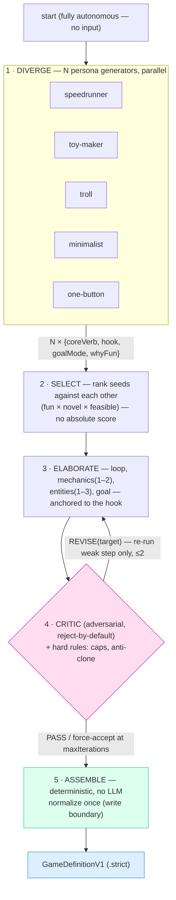
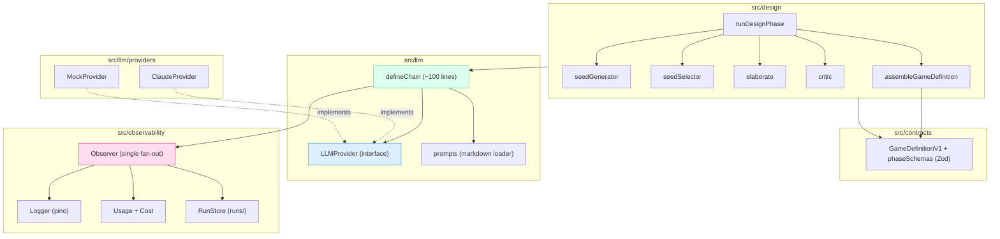

# Architecture — Game Factory

Milestone 1 = the **design phase**: the factory autonomously produces one validated `GameDefinition` from scratch (no input). See [PRD.md](./PRD.md) for requirements.

## Design-phase flow
Diversity from parallel personas; rigor from an adversarial critic. Fun is a *proxy* here — the real fun gate is M2 (running the game).



Steps 1–4 are LLM chains; step 5 is pure code. Each step returns a typed delta folded into a **new frozen `DesignState`** — no mutable shared bag.

## Module layers & dependency direction
Chains depend on the `LLMProvider` **interface**, never a concrete SDK (DIP). Providers implement it; `MockProvider` and `ClaudeProvider` are interchangeable (LSP).



## One chain call (`defineChain`) + observability seam
Explicit `format → invoke → parse`, then a single fan-out to the `Observer`. Usage is read from the response and **fails loud** if absent. `RunContext` is a required param everywhere (the type system enforces threading).

```mermaid
sequenceDiagram
    autonumber
    participant Orc as runDesignPhase
    participant Chain as defineChain
    participant Pr as prompts
    participant Prov as ClaudeProvider
    participant API as Anthropic API
    participant Obs as Observer → log/usage/store

    Orc->>Chain: run(input, {runContext})
    Chain->>Chain: inputSchema.parse(input)
    Chain->>Pr: load + render markdown
    Chain->>Prov: structured(outputSchema, system, msgs)
    Prov->>API: messages.parse (json_schema)
    API-->>Prov: data + response.usage
    Prov->>Prov: re-validate via same Zod; extractUsage (throw if missing)
    Prov-->>Chain: {data, usage, model}
    Chain->>Obs: llmCall(usage, ms, model, devTrace?)
    Chain-->>Orc: typed {data, usage}  (frozen delta)
```

## Run trace
Every run writes `runs/<traceId>/` — `events.jsonl` (streamed) + `trace.json` (finalized): node timings, per-call/per-model tokens from `response.usage` + USD cost, critic iterations, progress events. Inspect with `make view TRACE=<traceId>`.
